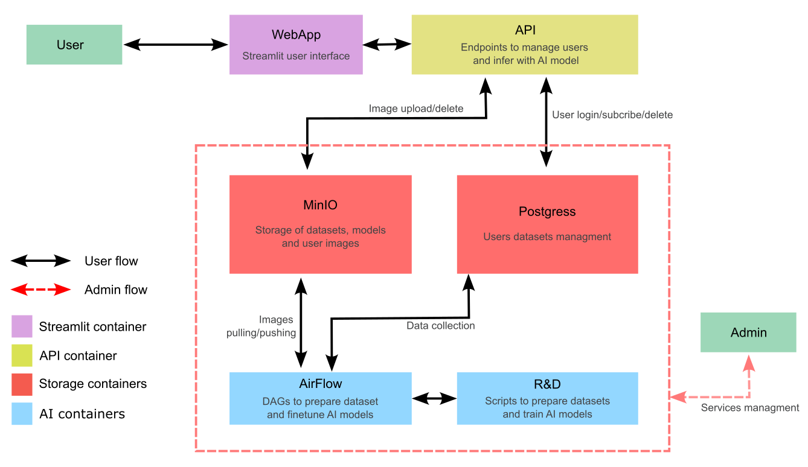

<div align="center">
  

  <h1>PicoPix: Image Colorizer</h1>

  <p><em>Source: Logo generated with DALL-E</em></p>
</div>


La colorisation d'images est un probleme auquel est confronté la communauté de vision par ordinateur. Ce projet implémente 2 méthodes de l'état de l'art pour la résolution de cette problématique avec un structure MLOps complète pour la gestion et maintenance de l'application et l'amélioration des modèles utilisés. 


## Structure du projet

```bash
.
├── Makefile                    <--- racourcie des commandes docker pour le lancemant des conteneur
├── README.md                   <--- Présentation du projet
├── dataset
│   ├── README.md               <--- Présentation de la basse de données initiale
│   ├── dataset_preparation.sh  <--- Script de préparation de la base de donnée initiale 
├── docker                      <--- Dossier des fichier de configuration Docker
│   └── ....
├── docker-compose.dev.yaml     <--- Composition des dockers de développement
├── docker-compose.cuda.yaml    <--- Composition des dockers de production avec prise en charge de GPU
├── docker-compose.yaml         <--- Composition des dockers de production
├── references                  <--- dossier de documentation
├── airflow
│   ├── dags
└── src                 
    ├── api                     <--- API
    │   ├── README.md
    ├── rd                      <--- partie r&d du projet
    │   ├── README.md
    └── webapp                  <--- application web via Streamlit
    │   ├── README.md
```

## Worflow

<div align="center">
  
</div>


### Explication des conteneurs : 
- **WebApp** : Une application `Streamlit` qui fournit une interface utilisateur intuitive pour interagir avec le système.
- **API** : Une application web qui assure la gestion des interactions entre l'utilisateur et les différents services proposés (par exemple, requêtes de données ou exécution de traitements).
- **R&D** : Un service dédié à la gestion et à l'entraînement des modèles d'intelligence artificielle (IA). Ce dernier est basé sur `MLflow`
- **Airflow** : Un outil de gestion des workflows permettant de mettre à jour et de déployer les modèles d'IA récemment entraînés.
- **MinIO** : Un système de stockage d'objets utilisé pour gérer les images des utilisateurs ainsi que les modèles d'IA.
- **PostgreSQL** : Une base de données relationnelle qui gère et stocke les informations des utilisateurs, ainsi que les métadonnées liées aux modèles et aux services.


## Utilisation
Pour lancer tous les conteneurs en local, il vous suffit de clôner le répertoire et lancer les conteneurs. les commandes suivantes illustrent ceci :

___Note : Avant de lancer les conteneurs, veuillez créer le fichier `.env` à base du template fournit dans le répertoire.___
```bash
git clone git@github.com:mchelali/picopix.git
cd picopix/ 
make start
```

Pour lancer les conteneurs avec la prise en charge de cuda
```bash
make custart
```

Si vous exécutez ce code sur votre machine personnelle, veuillez utiliser les urls suivantes pour accéder aux différents services proposés :

* R&D : http://localhost:8002
* MinIO : http://localhost:9001
* Streamlit : http://localhost:8501
* PgAdmin : http://localhost:5050

Pour stopper les conteneurs
```bash
make stop
```