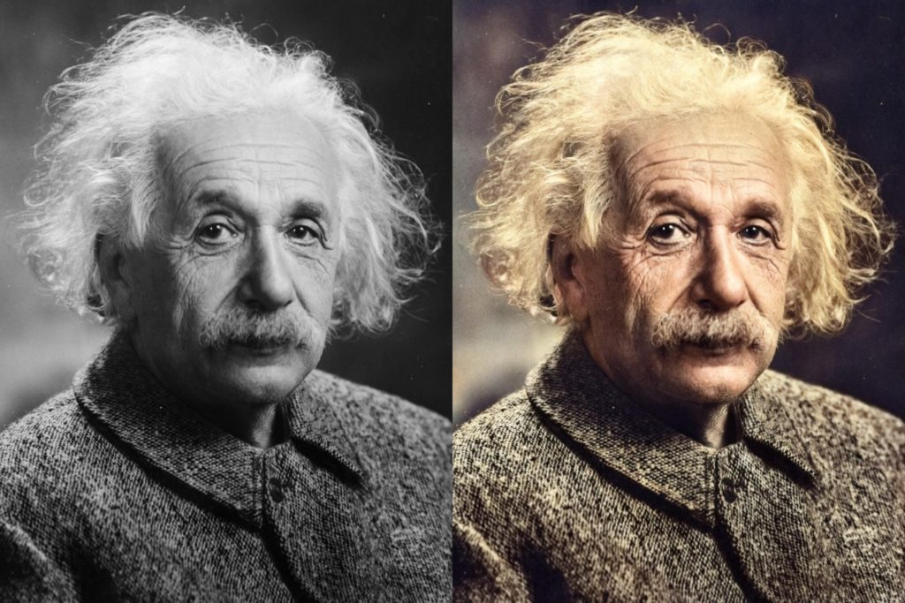
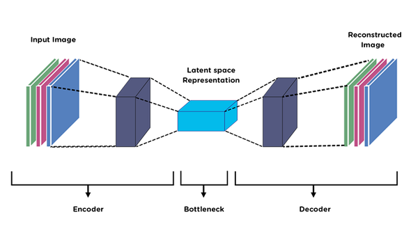
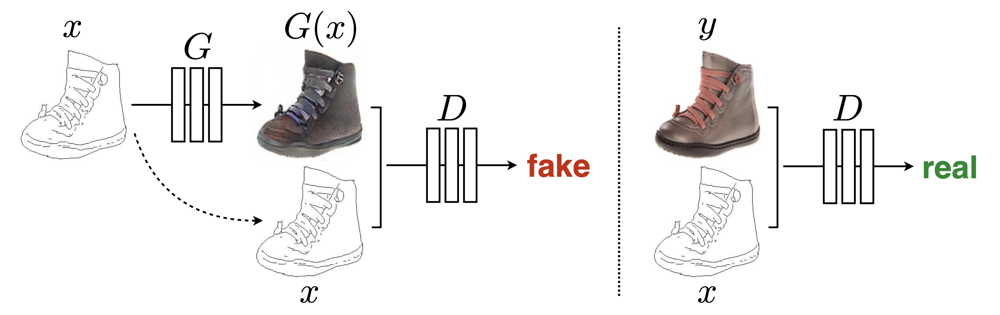

# ColorPix

## Contexte et Objectifs
 La **colorisation photographique** est un procédé qui consiste à ajouter de la couleur aux photographies. Ce procédé existe depuis la moitié du 19 ème siècle et peut désormais être grandement réalisé par l’utilisation de modèles de Machine Learning à base de réseaux neurones. Les applications pratiques sont variées, et peuvent être de nature purement artistique, historique (photos de lieux ou d’évènements importants) ou personnelles (photos de famille). Dans le cadre du projet qui entérine le cursus MLOps de Datascientest, nous proposerons un service de colorisation de photo en noir & blanc. La figure ci-dessous illustre un exemple de colorisation d’une image du célèbre scientifique Albert Einstein.

  
  
<em>Figure 1: Un exemple de colorisation d’image.</em>

Celui-ci devra pouvoir être délivré par l’intermédiaire d’une API, et pourra être sollicité par n’importe quel type d’interface graphique (page web, application mobile). Dans le cadre du projet, nous proposerons une interface graphique basée sur Streamlit afin d’illustrer son application concrète. 

Une authentification sera intégrée à l’API, afin de limiter les accès aux personnes autorisées, et de mieux contrôler la charge serveur.

## Méthodes et modèles

La colorisation d’images est un problème difficile. Théoriquement parlant, le passage d’une image couleur à une image noire et blanc se fait via la moyenne des bandes spectrales (rouge, vert et bleu) de l’image. Mais l’opération inverse reste impossible, car il y a une perte de données suite à la moyenne. De nos jours, l'intelligence artificielle permet de réaliser de telles opérations grâce à la quantité de données disponible et aux ressources de calculs. 

Dans ce projet, Nous avons sélectionné deux modèles relativement efficaces dans ce type de tâche de colorisation. Ces derniers seront implémentés, entraînés et évalués dans le cadre du projet : 

- **AutoEncoder** : Les encodeurs automatiques sont un type spécial d’architecture d’apprentissage de réseaux neuronaux composé d’un encodeur et d’un décodeur. L'encodeur est un réseau de neurones convolutionnels qui va encoder l’image dans un espace de représentation latent de dimension D. Tandis que le décodeur, est aussi un réseau de neurones mais avec des convolutions inverses et tente de régénérer les données à partir de ces représentations. La figure 2 illustre un schéma de ce type de modèle.

  
  
<em>Figure 2 : Illustration d’un autoEncodeur.</em>

- **Pix2pix** : Ce modèle fait partie de la famille des réseaux antagonistes génératifs conditionnels (GAN). Le modèle **pix2pix** est une architecture de réseau de neurones dédiée aux tâches de traduction d'images, c'est-à-dire qu'il permet de transformer une image d'un domaine source vers un domaine cible. utilise une architecture en deux parties : un générateur et un discriminateur. Le générateur prend une image source, l'encode dans un espace latent, puis génère une image de sortie qui cherche à correspondre au domaine cible. Le rôle du discriminateur est de distinguer les images générées des vraies images du domaine cible. La figure 3 illustre l'entraînement conditionnel du pix2pix.

Contrairement aux autoencodeurs, pix2pix est supervisé par des paires d'images (source-cible) et génère des images en fonction de correspondances explicites, ce qui le rend efficace pour des tâches comme la colorisation, la traduction de croquis en images réalistes, et plus encore.

  
  
<em>Figure 3 : Entraînement conditionnel du pix2pix.</em>

Dans nos expérimentations, nous avons utilisé différentes métriques associées à chacun des modèles.  L’erreur quadratique moyenne (MSE) pour l’évaluation des modèles. Mais elle est aussi utilisée comme fonction de perte lors de l'entraînement pour les deux modèles. Par contre, le modèle pix2pix utilise une deuxième fonction qui est la distance de norme L1 afin d’ajouter plus de critères au modèle. 

## Bases de données

Les données utilisées pour entraîner nos modèles sont les images de la base **MSCOCO**. Cette dernière a été proposée par Microsoft à des fins de détection et reconnaissance d’objet, segmentation ou la description d’images en textes. Elle contient plus de 330 000 images annotées. Dans notre cas, nous n'utilisons que les images et nous n’avons pas besoin d'annotations. 

Dans un premier temps, un script python permet de télécharger cette base et la diviser en trois ensemble (entrainement, validation et de test). Les modèles sont ensuite entraînés et évalués sur ces données. 

En raison de la stabilité de cette base de données, il n’est pas nécessaire de la stocker éternellement sur nos serveurs mais il suffit de ne conserver qu’une trace des ensembles utilisés. Les futures données quant à elles seront stockées dans un serveur de type bucket S3 (dans notre cas c’est **MinIO**) avec une demande de **consentement** pour les utilisateurs afin d’avoir la permission de mettre à jour nos modèles avec leurs données qui peuvent parfois être **personnelles**.  

Par ailleurs, une base de données des utilisateurs sera quant à elle stockée dans une base de données de type POSTGRE. Cette dernière sera implémentée dans un conteneur Docker indépendant pour stocker les identifiants et mots de passe des utilisateurs.

## API

L’API que nous implémenterons sera basée sur le framework FastAPI car cette dernière permet de faire des requêtes en asynchrone, chose indispensable au moment de l’inférence avec nos modèles. Les routes de l’API sont les suivantes : 

**Routes utilisateur :**	

- Route GET “/” : test de l'accessibilité/fonctionnement de l’api  
- Route POST “/token” : récupération d’un token  
- Route POST “/add\_user” : ajout d’un utilisateur  
- Route DELETE “/del\_user” : suppression d’un utilisateur  
- Route GET “/status” : retourne le statut de l’api (disponible ou occupée)  
- Route POST “/upload\_img2colorize” : upload de l’image à colorier  
- Route GET “/colorize” : retour les 2 propositions d’images (avec les 2 modèles)

- Route GET “/user\_imgs” : affiche la liste des images coloriées de l’utilisateur (miniatures avec urls pour téléchargement)

- Route POST “/user\_setprefmodel”: permet de forcer un modèle (valeurs 0,1,2 avec 0=pas de modèles préférés, 1=AutoEncoder, 2=Pix2Pix cGAN)

- Route POST “/user\_imgrating”: permet de noter une colorisation

**Routes administrateur :**

- Route GET “/show\_users” : liste tous les utilisateurs (sauf les administrateurs)  
- Route GET “/show\_models” : liste tous les modèles de colorisation.

Ces routes constituent la base de notre API et peuvent évoluer selon le besoin

## Testing & Monitoring

Afin d’implémenter de façon sereine notre solution, nous envisageons d’intégrer les tests unitaires suivants : 

- test de conformité des données d'entraînement, de test et d’évaluation (taille,quantité)  
- test d'entraînement et d’évaluation des modèles (backlog MLflow)  
- test de sélection du meilleur modèle (backlog MLflow)  
- test d’alerte mail automatique (si problème de performances des modèles)  
- test de disponibilité de l’interface api  
- test du endpoint d’authentification (accès base postgres, récupération token)  
- test de gestion des utilisateurs (ajout, suppression, list)  
- test de disponibilité des modèles (traitement en cours ou non)  
- test d’injection de nouvelles images à entraîner  
- test de détection de drift (par insertion volontaire dans les données d'entraînement)

	  
Nous utiliserons MLflow dans notre cycle CI/CD afin de monitorer les performances des modèles. Compte tenu du type de modèles utilisés, la puissance et le temps de calcul nécessaire à l'entraînement sont corrélés à la taille du jeu de données (le nombre d’images). L’injection des nouveaux ensembles de données (entrainement/test/évaluation) et le réentraînement des modèles sera donc décidé par l’équipe de *Data Scientist*, et n’aura pas de déclenchement automatique. En revanche, l'intégration des meilleurs modèles sera automatisée (schedule).

## Application Web Streamlit pour ColorPix

L'interface utilisateur de ColorPix sera développée avec Streamlit, un framework Python permettant de créer rapidement des applications web interactives pour la data science. L'application Streamlit servira de front-end convivial pour l'API ColorPix, offrant les fonctionnalités suivantes :

* Page d'accueil avec présentation du projet et exemples de colorisation.  
* Interface d'authentification pour se connecter ou créer un compte utilisateur.  
* Zone de téléchargement d'images en noir et blanc à coloriser.  
* Affichage des résultats de colorisation des deux modèles (AutoEncoder et        Pix2pix) côte à côte.  
* Option pour télécharger les images colorisées.  
* Historique des colorisations précédentes de l'utilisateur.  
* Page de paramètres permettant à l'utilisateur de choisir son modèle préféré.  
* Feedback sur la qualité des colorisations pour améliorer les modèles.

   
L'application Streamlit communique avec l'API FastAPI backend via des requêtes HTTP, gérant l'authentification, le téléchargement des images, et la récupération des résultats de colorisation.

## Schéma d’implémentation

Le schéma d'implémentation pour ColorPix inclura les éléments suivants :
 
    
Client : Navigateur web accédant à l'application Streamlit
Front-end : Application Streamlit hébergée sur un serveur web nginx
API : FastAPI hébergée sur un serveur d'application
Base de données : PostgreSQL pour le stockage des utilisateurs et des métadonnées
Stockage d'objets : MinIO (compatible S3) pour le stockage des images
Modèles ML : Conteneurs Docker pour l'AutoEncoder et Pix2pix
MLflow : Pour le suivi des expériences et le monitoring des modèles
CI/CD : Pipeline d'intégration et de déploiement continu
Monitoring : Outils de surveillance des performances et de la disponibilité du système

